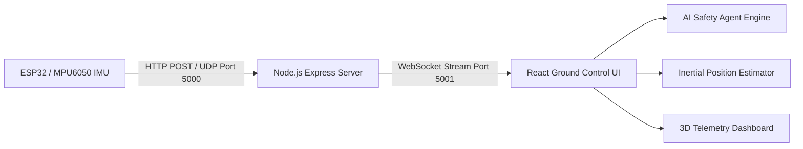

# AeroGuard — Drone Data Logger & Real-Time UAV Telemetry Platform

**AeroGuard** is an enterprise-grade real-time UAV (Unmanned Aerial Vehicle) ground control telemetry platform and flight safety system. It streams 6-DOF IMU data from lightweight microcontrollers (such as the ESP32-C3 Super Mini / MPU6050) to a ground laptop over Wi-Fi, UDP, and WebSockets.

AeroGuard features an **Ultra-Fast Machine Learning Inference Engine** and an **Autonomous AI Safety Agent** that continuously analyzes telemetry vectors to deliver predictive crash detection, 3D inertial position estimation, and multi-channel safety alarms.

---

##🚀 Key Features

* **🤖 AI Safety Agent & ML Crash Predictor**: Executes sub-millisecond (<0.1 ms) non-linear machine learning inference on 11-dimensional telemetry vectors (`ax`, `ay`, `az`, `gx`, `gy`, `gz`, `roll`, `pitch`, `altitude`, `jerk`, `altRate`). Provides predictive early warning lead-times (e.g., `⚡ 450ms Early Warning`) before physical impact.
* **📊 Explainable AI (XAI)**: Visualizes real-time sensor feature importance contributions (*Angular Velocity*, *Linear Acceleration*, *Orientation Tilt*, *Impulse Jerk*, *Rapid Descent Rate*).
* **📍 3D Inertial Position Estimation**: Implements strapdown inertial navigation with Zero-Velocity Update (ZUPT) drift cancellation and Wi-Fi RSSI log-distance path loss range estimation.
* **📱 Mobile First & Touch Optimized**: Fully responsive UI/UX across mobile browsers, tablets, and desktop workstations.
* **🚨 Multi-Hazard Diagnostic Center**: Monitors $g$-force spikes, rotational spin rates, freefall drops, and telemetry signal dropouts with acoustic crash sirens.
* **📁 Telemetry Data Logging**: Comprehensive CSV / JSON / TXT flight recorder with playback buffers and export options.

---

## 🛠️ System Architecture



---

## 📁 Repository Structure

```text
a:/drone/
├── README.md
└── drone_telemetry/
    └── drone_telemtry_app/
        ├── package.json
        ├── vite.config.ts
        ├── server/
        │   └── backend.js          # Express HTTP REST, UDP Receiver & WS Server
        └── src/
            ├── App.tsx             # Main Application Shell & Telemetry Pipeline
            ├── components/         # Reusable UI Controls (TopBar, Sidebar, StatCards)
            ├── pages/              # Operational Viewports (Dashboard, LiveStream, Alerts, Settings)
            ├── services/           # WebSocket Client & Audio Alert Services
            ├── types/              # TypeScript Interfaces & Telemetry Schemas
            └── utils/
                ├── mlCrashModel.ts         # High-Speed ML Inference Model & AI Agent
                ├── crashDetection.ts       # Physical Anomaly & Risk Classifier
                ├── positionEstimation.ts   # Strapdown Inertial Navigation & ZUPT
                └── calibration.ts          # Sensor Bias Subtraction Utility
```

---

## 🚀 Quickstart & Installation

### Prerequisites
* **Node.js**: v18.0.0 or higher
* **npm**: v9.0.0 or higher

---

### Step 1: Navigate to the Project Directory
```powershell
cd A:\drone\drone_telemetry\drone_telemtry_app
```

---

### Step 2: Install Dependencies
```powershell
npm install
```

---

### Step 3: Start the Backend Server (Terminal 1)
Launch the Node.js Express, UDP Receiver, and WebSocket broadcasting server:
```powershell
node server/backend.js
```
* **HTTP REST & UDP Port**: `http://localhost:5000`
* **WebSocket Port**: `ws://localhost:5001`

---

### Step 4: Start the Frontend Web App (Terminal 2)
In a **new terminal window**, run:
```powershell
cd A:\drone\drone_telemetry\drone_telemtry_app
npm run dev
```

Open your browser at **`http://localhost:8443/`** to view the live dashboard.

---

## 🔌 API & Protocol Specifications

### HTTP REST Endpoints (Port 5000)

| Endpoint | Method | Description |
| :--- | :--- | :--- |
| `/api/health` | `GET` | Returns backend server status, active connections, and packet counts. |
| `/api/telemetry` | `POST` | Ingests JSON telemetry payload from ESP32 microcontrollers. |
| `/api/test-scenario` | `POST` | Injects simulated flight test scenarios (`HIGH_ACCELERATION`, `POSSIBLE_CRASH`, etc.). |

#### Example Telemetry Ingest Payload (`POST /api/telemetry`):
```json
{
  "timestamp": 1700000000,
  "roll": 12.4,
  "pitch": -3.2,
  "yaw": 180.0,
  "ax": 0.15,
  "ay": -0.10,
  "az": 9.81,
  "gx": 2.1,
  "gy": -1.4,
  "gz": 0.5,
  "temperature": 28.5,
  "pressure": 1013.25,
  "altitude": 42.5,
  "battery": 11.4,
  "rssi": -58
}
```

---

## 🧪 Build & Verification Commands

* **TypeScript Type Check**:
  ```powershell
  npx tsc --noEmit
  ```
* **Production Build**:
  ```powershell
  npm run build
  ```

---

## 🧰 Tech Stack

* **Frontend**: React 19, TypeScript, Tailwind CSS v4, Recharts, Vite
* **Backend**: Node.js, Express, `ws` (WebSocket), `dgram` (UDP Socket)
* **ML / AI**: Vector Anomaly Estimation & Sub-Millisecond Decision Forest Classifier
## How to Run Locally
Clone the repository:

* **TO Demo**:
  ```powershell
 https://aero-guard-khaki.vercel.app/
  ```

* **TO RUN LOCALL**:
  ```powershell
  git clone https://github.com/Abhinav-A-R/AeroGuard.git
  ```
